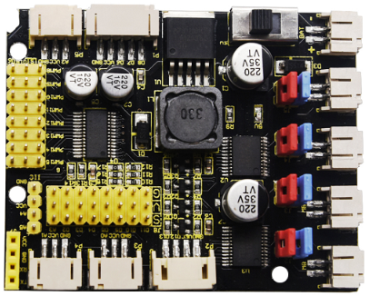
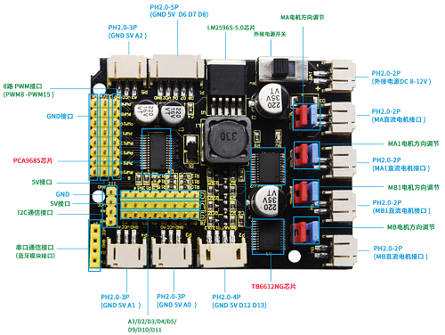
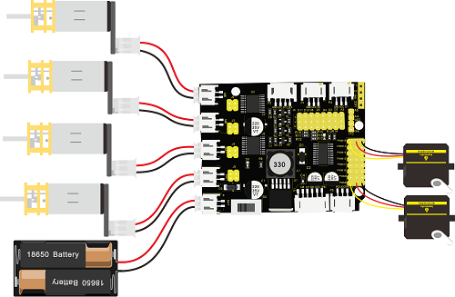

# KS0489 Keyestudio 4WD TB6612 Motor Driver Shield (Black and Eco-friendly)



## 1.Description

When DIY smart car, the motor driver board is required. We particularly design this driver board compatible UNO R3 control board. It is powerful and has following features:

1. Design in stacked style, only need to stack on UNO R3 control board which save space and facilitate to connect.

2. The two TB6612FNG chips on driver board can drive motor to rotate and 4 DC motors as well, which is convenient.

3. It comes with a PCA9685 chip(IIC address:0x47) which can output 16 channel PWM output, 8 of which is intend for controlling rotation speed and direction of 4 motors, the another 8 PWM output is led to by 3pin head of 2.54mm pitch and control other devices like servo motor.

4. Driver board expands D11/D10/D9/D5/D4/D3/D2/A3 pins of UNO R3 control board into 3pin head of 2.54mm pitch, leads to I2C communication port by 4pin head and serial communication port by 4pin female header, which facilitate to link with Bluetooth module.

5. Driver board comes with 5 PH2.0mm-2P anti-reverse interfaces for external power and 4 motors; 3 PH2.0mm-3P, 1 PH2.0mm-4P and 1 PH2.0mm-5P interfaces for connecting to sensors/ modules.

6. Power supply IC is LM2596S-5.0, with massive loading capacity, maximum current can reach 3A and drive multiple servos.

7. The built-in DIP switch on driver board enhances to control external supply.

8. jumper caps of driver board decide the rotation direction of motor. For instance, when 2 jumper caps of MA motor is connected in vertical way instead of horizontal way, its rotation direction is opposite.

9. Driver board can drive DC motor up to 12v. The voltage of drive motor is set by external power supply and test code. For example, when the external supply is DC 12V, set the PWM to maximum value and the corresponding driving voltage is 12 V.

## 2. Parameters

- Working voltage: DC 8-12V
- Drive current: up to 3A
- Maximum power: 10W
- Working temperature: -20 ℃ ～ ＋ 60 ℃
- White interface type: PH2.0 (-2P -3P -4P -5P)
- Pin header / female spacing: 2.54mm
- Size: 68.7mm * 55mm
- Environmental protection attributes: ROHS

**Pin Description**



**Connection Diagram**



Note: PWM8-PWM15 is only connected to 2 servos on above diagram, in the code , PWM8-PWM15 controls 8 servos to test.


**Test Code**

Library file download:    [Resources](./Resources.7z)

Note: attention data setting when adjusting speed, for instance, when external supply is DC 8V, if the maximum drive voltage of drive motor is 5V, set the maximum value of PWM to 4096*5/8=2560. The value can’t exceed 2560, otherwise external motor will damage.

```
#include <Wire.h>
#include <Adafruit_PWMServoDriver.h>
Adafruit_PWMServoDriver pwm = Adafruit_PWMServoDriver(0x47);
int value;
void setup()
{
  pwm.begin();
  pwm.setPWMFreq(60); 
 }

 void servo_1(int servopin,int myangle)
 {
   value=map(myangle,0,180,102,512);
   pwm.setPWM(servopin,0,value);
  }
 void servo_2()
 {
  for(int a=8;a<=15;a++) 
  {
  servo_1(a,0);//cite pulse function
  delay(300);
  servo_1(a,180);//cite pulse function
  delay(300);
  }
  }
void motor()
{
   pwm.setPWM(0,0,4095);
   pwm.setPWM(1,0,1024);
   pwm.setPWM(2,0,4095);
   pwm.setPWM(3,0,1024);
   pwm.setPWM(4,0,4095);
   pwm.setPWM(5,0,1024);
   pwm.setPWM(6,0,4095);
   pwm.setPWM(7,0,1024);
 delay(5000);
   pwm.setPWM(0,0,0);
   pwm.setPWM(1,0,2048);
   pwm.setPWM(2,0,0);
   pwm.setPWM(3,0,2048);
   pwm.setPWM(4,0,0);
   pwm.setPWM(5,0,2048);
   pwm.setPWM(6,0,0);
   pwm.setPWM(7,0,2048);
    delay(5000);
   pwm.setPWM(1,0,0);
   pwm.setPWM(3,0,0);
   pwm.setPWM(5,0,0);
   pwm.setPWM(7,0,0);
  
  }
  
void loop() 
{
   motor();
   servo_2();
}
```

**Test Result**

Upload test code on UNO R3 control board, wire according to connection diagram and power on. When DIP switch of driver board is dialed to BAT end, the external 4 motors rotate clockwise for 5s, counterclockwise for 5s and stops；moreover, 8 external servos rotate to 0° then 180°, and loop the previous action alternately.